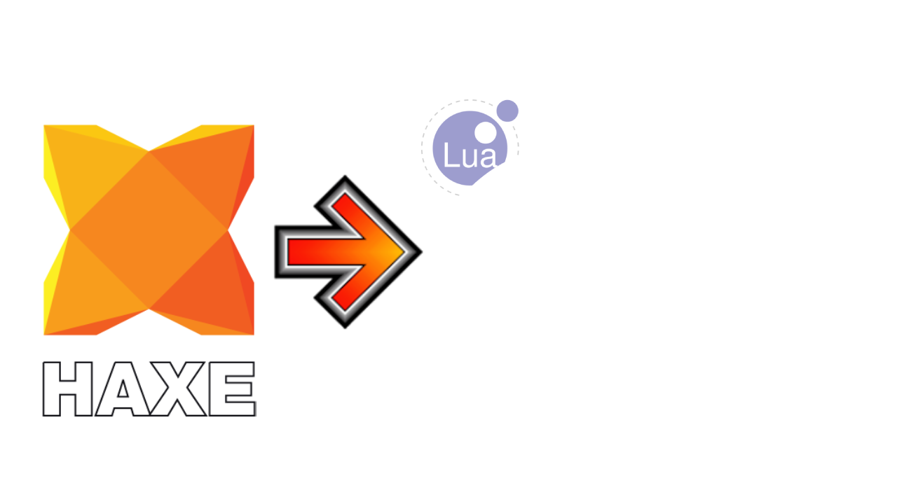

<div align="center">
  <h1>HxNotITG</h1>
  
  <h2 align="center"><em><strong>Now Haxe is on NotITG too, why not? :3</strong></em></h2>
</div>

So... yeah, this is a small template along with a special library to create modcharts with [Haxe](https://haxe.org) in [NotITG](https://www.noti.tg), once again taking advantage of the wonders of [Reflaxe](https://github.com/SomeRanDev/Reflaxe), this time from [Reflaxe/Lua](https://github.com/Davvex87/reflaxe.lua), and from [Mirin Template](https://github.com/XeroOl/mirin-template) to be able to use conventional [Lua](https://www.lua.org) in [NotITG](https://www.noti.tg) instead of its XML-based Lua.

See the [TODO list](./TODO.md) for future features.

See the [CHANGELOG](./CHANGELOG.md) for changes in the past.

> [!CAUTION]
> This library is in alpha state, it is extremely experimental and can very easily generate invalid code or behave incorrectly, modcharts in NotITG are something I don't know much about!.

Keep something in mind, this project is made for a very specific purpose, if you are not already familiar with [Haxe](https://haxe.org) or it is not your favorite or main language, honestly, use [Mirin Template](https://github.com/XeroOl/mirin-template) directly with [Lua](https://www.lua.org), which is an easier language to understand and learn.

Due to the apparent structure of a song in NotITG, I cannot fully cover the use of Haxe for everything, there will be things that you will probably still have to do in Lua or XML.

## Installation and usage

Assuming you already have [Haxe](https://haxe.org/download) installed...

In the folder where you will create your new song in NotITG, for example `Songs/Slushi/Haxe test`, first of all we need [Mirin Template](https://github.com/XeroOl/mirin-template), this is the base of this project, [download it from here](https://github.com/XeroOl/mirin-template/archive/refs/heads/master.zip) (or from the GitHub "Code" button) and copy the contents of what you downloaded into your song folder (or follow the [official guide](https://xerool.github.io/mirin-template/Getting-Started.html))

Now you need this template, same thing, [download it from here](https://github.com/Slushi-Github/HxNotITG/archive/refs/heads/main.zip) (or again, from the GitHub "Code" button) and copy the contents (you can skip copying the `docs`, `.gitignore` and `.gitattributes` `TODO.md`, and folders/files like that if you want) into your song folder, it will usually ask you to replace files, do it!

Now you need the library used with this template, you have two ways to get it:

Get it from haxelib (not available yet):

```bash
haxelib install hxnotitgframework
```

Or from GitHub:

```bash
haxelib git hxnotitgframework https://github.com/Slushi-Github/HxNotITGFramework.git
```

Finally, you need Reflaxe and Reflaxe/Lua:

```bash
haxelib git reflaxe https://github.com/SomeRanDev/reflaxe.git
```

```bash
haxelib git reflaxe.lua https://github.com/Davvex87/reflaxe.lua.git
```

And that's it! now you can edit `haxeSrc/HaxeResult.hx` to create your modchart, and convert it to Lua using `haxe build.hxml` in your song directory, and that's it, you have your modchart in Lua working in NotITG! Remember to run `haxe build.hxml` every time you make a change in your Haxe code.

# Documentation

This part is still being planned, it's best to check Mirin Template stuff [on its website](https://xerool.github.io/mirin-template), such as the [modifiers list](https://xerool.github.io/mirin-template/docs/mods.html)

## Credits

* [Mirin Template](https://github.com/XeroOl/mirin-template): The base of this project and a good way to use NotITG with Lua easily.

* [Reflaxe](https://github.com/SomeRanDev/Reflaxe): An incredible library to use Haxe in unexpected places hehe.

* [Reflaxe/Lua](https://github.com/Davvex87/reflaxe.lua): Without this, I wouldn't be able to generate truly functional and independent Lua code compared to what Haxe originally generates.

## License

This project is under the [MIT license](./LICENSE.md).

